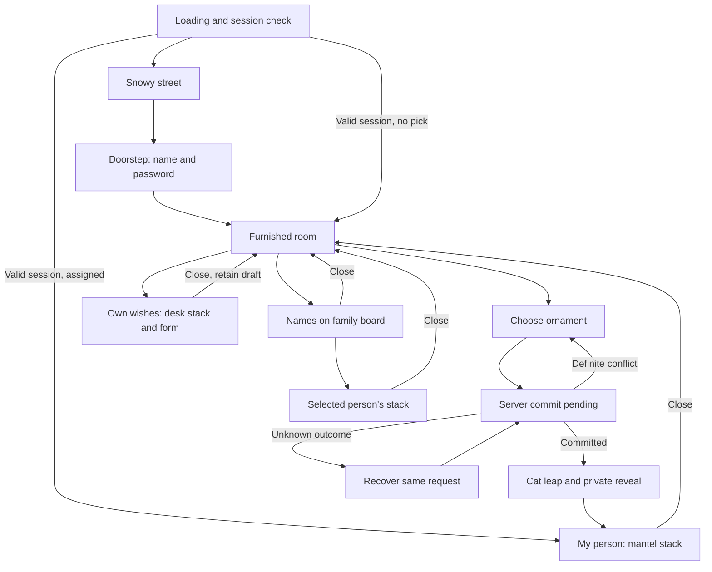

# UX/UI specification

20 September 2026 · chosen Winter House direction · paired with the
[product contract](spec.md). The [live prototype](prototypes/winter-house/index.html)
is the visual reference; its data model and security are not production designs.

## 1. Art direction

A small, inhabited Central European Christmas home: cream plaster, uneven
wood, cranberry fabric, spruce branches, amber firelight and a deep teal
snowy evening. Slightly silly, tactile and affectionate. The geometry may be
stylised; movement and lighting should make the home feel occupied.

Keep the room large in the frame, with foreground furnishings and a faded
snowy landscape beyond the cutaway. No right-hand wall may obstruct the view.
The room must feel furnished before the camera passes through the door.
Do not recreate each destination as a generic centred card over a backdrop.

Use Fraunces for headings, DM Sans for controls and reading. Handwritten
accents are optional and brief; never use them for long wishes or errors.
Self-host licensed font subsets including Hungarian ő/ű and uppercase forms.

Initial UI token palette, to validate against the rendered scene:

| Token     | Value     | Use                              |
| --------- | --------- | -------------------------------- |
| Night     | `#102b32` | Sky and dark translucent backing |
| Paper     | `#f7efdd` | Wish sheets and writing forms    |
| Ink       | `#30271f` | Paper text                       |
| Cream     | `#fff4df` | Scene labels and headings        |
| Cranberry | `#a54039` | Actions, fabric and seal         |
| Spruce    | `#34533b` | Secondary details                |
| Gold      | `#efc677` | Warm focus and light accents     |

These are UI starting values, not calibrated shader colours. Measure contrast
on final composited backgrounds. Text over scenery needs a dark contour and,
where necessary, a calm translucent backing. Use at least 4.5:1 normal-text
contrast and 3:1 large-text/control contrast. Glow never replaces an outline.

## 2. Journey and navigation

Camera state is presentation state, separate from committed exchange data.
Rapid navigation cancels obsolete travel and pending reads; it never undoes
a successful mutation. Browser Back closes the current sheet/form/visit
before leaving the house. No navigation action may secretly submit a draft.

Routes represent durable destinations, not individual animation frames:
`/`, `/house`, `/house/tree`, `/house/person`, `/house/wishes`,
`/house/family`, `/house/family/:participantId`. Authentication guards resolve
identity before rendering private content. A direct link to `/house/person`
contains no recipient ID. Unassigned participants are directed to the tree.
Opening someone else's public-within-group family stack uses the same rules
as navigating through the board. Simple view retains these destinations.

While the tree is open, a live update gently dims an unavailable ornament
and removes its selectable action without moving any other slot or the camera.
Update both DOM and raycast targets together. Keep keyboard focus on the same
slot using an accessible disabled state; announce a brief availability change
once, coalescing bursts rather than speaking every participant's pick. Never
show who picked or who was drawn. Reduced motion changes the state immediately.

During a pending/unknown pick, availability updates must not override that
command's status or unlock another selection. If a slot becomes unavailable
between pointer-down and activation, reject the local activation and announce
the change; the server still checks every submitted pick. Connection trouble
shows a quiet “Keeping your choices up to date…” status and uses polling.
A failed network does not display “live” or fabricate a fresh pool. Returning
from a hidden tab refreshes before enabling choices again.

### Stage requirements

| Stage           | Camera and physical target                                               | UI and interaction                                                | Acceptance                                                                   |
| --------------- | ------------------------------------------------------------------------ | ----------------------------------------------------------------- | ---------------------------------------------------------------------------- |
| 01 Street       | Cottage, visible sky, red door                                           | One “Knock, knock” label attached to the door; short welcome copy | Door visible and reachable at 320px and ultrawide; no duplicate yellow CTA   |
| 02 Doorstep     | Walk to the closed door, room visible through opening/window             | Name selection and password at threshold; protected names marked  | Room is already furnished when door opens; identity precedes entry           |
| 03 Room         | Wide cutaway with board left, mantel centre, tree right, desk foreground | Floating labels above physical destinations; utilities at top     | Labels do not collide with named cards or each other; walls never fill frame |
| 04 Tree         | Tree and cat both in view                                                | Glowing red/purple/blue/gold slots; clear irreversible warning    | Minimum 44px targets, stable placement, six ornaments per branch/page        |
| 05 Reveal       | Cat fetches selected slot, recipient appears on paper                    | Private name, continue to wishes, skip animation                  | Name matches committed server result; recover without another draw           |
| 06 Desk         | Curve around desk, settle above chair, paper lifts from desktop          | Own stack, add/edit form on top paper; lamp on                    | Feels seated with desk in front, not floating outside it; keyboard fits      |
| 07 Family board | Zoom onto physical names                                                 | Up to eight name cards per page, then lifted wish stack           | Names only; no wish count; controls never overlap cards                      |
| Mantel          | Zoom onto envelope above fireplace                                       | Recipient stack rises from letter between candles                 | Clicking letter and label are equivalent; return visits restore here         |

Chapter numbers are presentation labels, not backend state or a required
linear wizard. After entry, desk and family board are available before drawing.

At the doorstep, “Forgot your password?” provides the configured organiser
contact instructions. Recovery opens a small HTML form with new-password and
confirmation fields, expired-link guidance and a return to normal login.
It preserves the person's exchange data. The organiser has a separate “Help
reset password” action per person, with recent password confirmation and a
copyable one-time link. Never show their assignment in that workflow.

A full-season reset confirmation explicitly says that all participant passwords
will be cleared and every name can be claimed again. Keep it visually separate
from helping one person recover access.

## 3. Paper surfaces and forms

Use real semantic HTML aligned to a 3D paper plane with CSS projection.
The mesh supplies edge thickness, shadow and motion; DOM supplies text,
inputs, focus, selection and accessibility. Board name cards use the same
technique. HTML-in-Canvas is explicitly deferred.

One readable sheet is active. Offset sheets imply a stack without exposing
other text through the top page. On arrival, finish camera travel, lift the
paper, then enable controls and focus its heading. At reduced motion these
steps settle immediately. Disable camera orbit and background object actions
while reading or writing; clicking the surrounding room closes the stack.
An event originating inside the paper, a link, or a utility must not count
as an outside click. A drag ending outside must not dismiss it accidentally.

The desk sheet contains a labelled description textarea and character count,
optional URL, quiet preview region, priority fieldset, save and cancel.
Three stars form one native radio group, with one, two or three stars filled.
Keep “Just a little idea”, “Would be lovely”, “Would really love this” and their
Hungarian equivalents as accessible labels and tooltips, without visible copy.
Save and cancel share one row; save is green and cancel has a quiet outline.
The room-return button sits below the paper without covering the form. Errors sit beside
the field and are linked with `aria-describedby`; save failure retains text.
Submitting shows a pending state, then returns to that saved sheet.

Own unclaimed sheets have quiet edit/delete icons beside the star priority,
with accessible labels, tooltips and 44px tap targets. Deleting opens an inline
confirmation. Refresh sits beside the name; adding a wish is a compact green
action in the note footer. A claimed sheet has disabled actions and
“This wish can't be changed right now.” The owner can infer that it is claimed,
but sees no buyer, claim timestamp or purchase badge. A release enables editing
again on refresh. Other people's sheets have claim/release status. If a draft
was open when someone claimed the wish, saving returns the locked state;
keep the unsaved text for copying into a new wish, never overwrite the locked one. On content-version conflict preserve the local
draft and
show the latest saved content with an explicit reload/replace decision.

For close/Escape/outside click, keep unfinished writing in memory and return
to the room. Reopening the same editor restores it. Cancel is the explicit
discard action. Do not promise recovery after refresh or sign-out. When a
request is still pending, closing changes presentation only; report its result
on return and do not submit a second request automatically.

Stacks with multiple wishes have borderless previous/next arrows and a quiet
page count alongside the add action. Hide pagination for a single wish.
The room-return control is attached below the projected paper, with a clear
gap from the full stack; it follows the paper during resizing and camera movement.
Only handle arrow keys when
focus is on stack navigation or its reading region, never within input/text
selection. Keep the current item by ID after refresh; if deleted by its author,
show “This wish was removed” and move to an adjacent sheet on acknowledgement.

## 4. Camera, projection and mobile behavior

Specify semantic anchors (`door`, `room`, `tree`, `mantel`, `desk`, `board`)
and safe framing bounds. Derive camera distance/target from aspect ratio and
object bounds; do not independently hardcode a different scene per breakpoint.
Keep the fireplace, tree and table recognisable during ordinary room visits.

Prototype-like timing starting points: 1.2–1.8s initial walk, 0.6–1.1s room
travel, 0.25–0.4s paper lift. Use smooth acceleration/deceleration with no
bouncing camera or roll. User navigation takes precedence over ambient motion.
Tune using physical devices, not these durations alone.

At 320–480px, reduce the field of view/fit as necessary, stack form actions,
and let paper content scroll. Never shrink controls below touch size. At wide
ratios, fit the room horizontally without leaving large unused strips on both
sides. Do not crop the tree top into its heading; put the tree heading in quiet
space to the left on desktop and above the target area on mobile.

Use `visualViewport` and safe-area insets to resize the available paper region
when the keyboard opens. Preserve a readable text size (16px minimum for
inputs), field focus and caret. Scroll the focused field into the paper's
visible region. If perspective projection makes the form unreadable, flatten
the paper toward the camera while keeping its desk origin apparent.

Projection must reject anchors behind the camera or clipped by the viewport;
hidden targets cannot remain focusable. Resolve label collisions with defined
priority: active task, destinations, then decorative actions. At a close-up,
only that destination's controls remain active. Provide an always-reachable
HTML destination list through the utility menu for keyboard/simple-view users.

## 5. Living room and outdoor choreography

| Element           | Behavior                                                                          | Constraints                                                             |
| ----------------- | --------------------------------------------------------------------------------- | ----------------------------------------------------------------------- |
| Fireplace         | Changing flames, ember drift and gentle warm light                                | No fast flashing; retain static warm fire under reduced motion          |
| Desk lamp         | Warm bulb, shade glow and visible pool on paper/table                             | On from desk arrival until leaving; independent of ambient pause        |
| Window            | Layered falling snow, hazy roofs, changing warm windows, occasional passing light | Lightweight suggestion of a living city; no detailed city simulation    |
| Cat               | Idle, pet reaction, sofa hop and curled nap; wakes before ornament fetch          | Explicit action state prevents jump/nap conflicts; paws/body articulate |
| Cookies           | Three biscuits; one disappears with crumbs per completed click                    | Ignore repeated clicks during bite; empty plate remains empty for visit |
| Audio             | Fire/room ambience, chimes, cookie chewing/crunch                                 | On by default after first gesture; respects mute and hidden tab         |
| Snowman/snowballs | Infrequent passing movement outside                                               | Decorative, never receive focus or intercept clicks                     |
| Santa             | Clear sleigh/reindeer silhouette in visible sky, 14s crossing, roughly every 52s  | First pass starts around 6s of visible ambient time; room/street only   |
| Shooting star     | Bright core, long golden trail, roughly 3.6s every 28s                            | First pass around 3s; visible on mobile and wide room/street views      |

Santa/star paths follow the camera's visible sky region at a believable distant
depth. They must not live behind terrain or require a lucky orbit angle. Hide
them during travel and reading close-ups. Timing is a tuning baseline, not
server time. Pausing or hiding the page does not accumulate events for a burst
on return. No decoration makes a network request or persists group state.

Ambient pause freezes snow, fire movement, window changes and outdoor events;
intentional actions still complete. System reduced motion skips camera, cat
jump, crumb flight and sheet travel, freezes ambient effects and hides Santa/
star flight. A still cat on the chosen sofa and a steady lamp convey results.
Hidden tabs stop rendering and suspend audio; re-enter with a bounded delta.

## 6. Loading, error and empty states

| Situation             | Required response                                                                                                                 |
| --------------------- | --------------------------------------------------------------------------------------------------------------------------------- |
| Loading scene         | Paint shell and fact before heavy imports; actual progress or honest indeterminate indicator; retry and simple view after failure |
| No wishes yet         | Reassuring note, guidelines, and room return; own list invites writing                                                            |
| Incorrect password    | Inline retry, preserve selected name, clear password; never blame                                                                 |
| Session expired/reset | Remove private sheets immediately, retain no previous identity's draft; explain and return to doorstep                            |
| Pick unavailable      | “That little secret is no longer available. Choose another.” Refresh existing slots; no new mapping                               |
| Pick outcome unknown  | “Checking your choice…” with retry/recovery; no new selection until resolved                                                      |
| Claim conflict        | Refresh that wish, show that someone is taking care of it                                                                         |
| Network failure       | Keep readable loaded content, disable unsafe actions as needed, retain draft, explicit retry                                      |
| Preview unavailable   | Plain link and description; subdued note, no alarming form error                                                                  |
| WebGL/context loss    | Preserve session/domain state and writing, offer simple view; renderer retry does not reset the season                            |

Write English and Hungarian strings separately against the same message keys.
Facts use the existing [sourced copy](prototypes/winter-house/facts.js), including
Mikulás and szaloncukor. Do not invent a percentage for work with unknown total.
Loading copy must not impose a minimum wait once the app is ready.

## 7. Accessibility and organiser UI

The canvas is decorative to assistive technology; equivalent DOM targets and
content carry the interaction. Provide one accessible action per target,
not a mesh action plus a duplicate tab stop. A labelled reading dialog can
trap focus while open; close returns focus to its invoking room target.
Announce the revealed recipient and mutation results once. No focusable
controls remain behind an open dialog. Utilities remain reachable through
its labelled controls or by closing it.

Provide visible focus on dark and light backgrounds, 200% text enlargement,
400% zoom with usable reflow/simple view, keyboard completion and screen-reader
checks. No hover-only labels, drag-only navigation or audio-only feedback.
Password inputs support autocomplete and a labelled show/hide button.

The organiser uses a clean, warm HTML workspace, not 3D configuration controls:
roster editor, directed-exclusion matrix with row/column labels, feasibility
result, open review, and separate reset area. The matrix must remain keyboard
usable and have a compact list alternative on phones. No assignments, claimer
names, hidden-slot mappings or named draw-progress dashboard.

## 8. Visual acceptance captures

Capture street, doorstep, room, tree, reveal, mantel, own stack, writing with
keyboard, family board, family stack, empty/error states and simple view.
Use 320×568, 390×844, 768×1024, 1440×900 and 2560×1080 layouts; include 30
participants, long Hungarian names/copy, maximum-length wishes and text zoom.

Verify the unobstructed room, heading contrast, glowing lamp, card/label
separation, seated desk framing, outside dismissal, correct selected ornament,
visible Santa/star, paused/reduced-motion state and no layout jumps during
language changes. A screenshot alone does not verify correct data or keyboard
behavior; pair it with the behavioral checks in the delivery plan.
